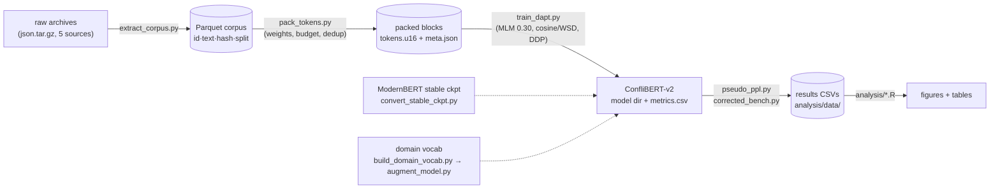

# ConfliBERT-v2

**Domain-adaptive pretraining of [ModernBERT](https://huggingface.co/answerdotai/ModernBERT-base) for political conflict and event-data research.**

  

[ConfliBERT (2021)](https://github.com/eventdata/ConfliBERT) showed that a
domain-pretrained encoder beats general-purpose models on conflict-event
coding, but it inherits BERT's 512-token window and 2019-era architecture.
ConfliBERT-v2 continues pretraining **ModernBERT** (8,192-token native
context; the scaled run targets **both sizes**: base, 150M params, and large,
395M) on a large curated political conflict corpus, giving the event-data
community a modern, long-context, locally fine-tunable foundation.

This repo contains the **complete pipeline** - corpus construction, token
packing, DAPT training, tokenizer surgery, and a 9-task evaluation harness -
plus ready-to-submit **Slurm jobs for NCSA Delta**, where the scaled-up
training run happens. Pilot runs (2.5B and 5B tokens, single desktop GPU)
validated every recipe here; the numbers below tell you what to expect.

---

## ⚠️ Ground rules: read before anything else

This is a multi-team effort. These rules keep it reproducible; every one of
them exists because breaking it costs someone else a rerun.

1. **Data never enters git**: no corpora, packs, model weights, or logs. Git
   holds code, docs, and the results CSVs in `analysis/data/`.
2. **Every corpus source, whatever format it arrives in, converges to the one
   Parquet schema** in [`docs/PIPELINE.md`](docs/PIPELINE.md), which also has
   the step-by-step for bringing in a new source (JSONL, CSV, TXT, PDF, ...).
3. **Names are permanent**: source names and model names key the results
   record; register a source before first use, never reuse a model name.
4. **Results CSVs are append-only and committed**; never hand-edited.
5. **Secrets live in environment variables**, never in files or commits.
6. **Pack on CPU partitions; GPUs are for training and evaluation only.**

The full contracts: [`docs/PIPELINE.md`](docs/PIPELINE.md). The team workflow:
[`CONTRIBUTING.md`](CONTRIBUTING.md).

---

## Repository map

| path | what lives there |
|---|---|
| `src/data/` | Stage 1-2: corpus extraction → Parquet; tokenize + pack into MLM blocks; CrisisWatch corpus construction |
| `src/pretrain/` | Stage 3: `train_dapt.py` (the training entry point, single-GPU or DDP), tokenizer augmentation, stable-checkpoint conversion, TAPT |
| `src/eval/` | Stage 4: 9-task fine-tuning benchmark, pseudo-perplexity, cross-fitted event coding, sliding-window inference, LLM API baselines, throughput |
| `scripts/` | Pilot-rig orchestration (WSL, single GPU) - reference recipes for every run we've done |
| `hpc/` | **NCSA Delta**: path contract, environment setup, sbatch jobs for pack / pretrain / eval |
| `analysis/` | R figures + Python analysis; `analysis/data/*.csv` is the committed experimental record |
| `docs/` | The knowledge base - see "Read this first" below |
| `env/` | Pilot (WSL2) environment setup + smoke test |
| `hf/` | HuggingFace model card |

**Read this first:**
[`docs/PIPELINE.md`](docs/PIPELINE.md) - the input/output contract every stage obeys (team-critical) ·
[`docs/HPC_DELTA.md`](docs/HPC_DELTA.md) - zero-to-trained on Delta ·
[`docs/STATUS_AND_NEXT.md`](docs/STATUS_AND_NEXT.md) - full experimental log ·
[`CONTRIBUTING.md`](CONTRIBUTING.md) - team workflow rules.

## The pipeline



Every arrow is a documented contract (formats, naming, invariants) - see
[`docs/PIPELINE.md`](docs/PIPELINE.md). Data and models never enter git; the
results CSVs always do.

## Quickstart

### On NCSA Delta (the intended way)

```bash
cd /projects/<alloc>/$USER
git clone <this-repo> conflibert-v2 && cd conflibert-v2
cp hpc/paths.env.example hpc/paths.env        # set CB2_ALLOC=<your allocation>
bash hpc/setup_delta.sh                       # venv + deps + model pre-cache
# stage the Parquet corpus to $CB2_CORPUS (team share / Globus), then:
bash hpc/submit.sh hpc/pack_corpus.sbatch     # CPU partition
bash hpc/submit.sh hpc/pretrain.sbatch        # 1× A100x4 node, resume-safe
bash hpc/submit.sh hpc/eval.sbatch "$CB2_MODELS/conflibert-v2-hpc"
```

Hit the wall clock? Resubmit `pretrain.sbatch` unchanged - `--auto-resume`
continues from the last checkpoint. Full guide, filesystem rules, and scaling
notes: [`docs/HPC_DELTA.md`](docs/HPC_DELTA.md).

### On a single local GPU (pilot rig)

```bash
pip install torch --index-url https://download.pytorch.org/whl/cu124
pip install -r requirements.txt
python env/smoke_test.py

python src/data/pack_tokens.py --corpus .../corpus/parquet --split train \
  --seqlen 1024 --max-tokens 2500000000 --dedup \
  --source-weights "News=1.0,Organization=1.0,UTDstory=1.0,Gigaword=0.7,Wikipedia=0.25" \
  --out .../packed/train_1024_native

python src/pretrain/train_dapt.py \
  --train .../packed/train_1024_native --eval .../packed/eval_random_1024_native \
  --out .../runs/conflibert-v2 \
  --scheduler wsd --lr 2e-4 --warmup-ratio 0.03 --decay-ratio 0.20 \
  --mlm-prob 0.30 --bsz 8 --accum 32 --epochs 1
```

The `scripts/run_*.sh` files are the exact pilot pipelines (pack → train →
finalize → eval) for every recipe variant - start from
`scripts/run_r1_wsd_pipeline.sh` (the headline recipe) when composing a new run.

## What the pilot established

Nine-task benchmark (7 classification + 2 NER), corrected protocol - dev-selected
LR per task, 3 seeds, prefix-space fix for ByteLevel-BPE NER:

| model | 9-task mean F1 | notes |
|---|---|---|
| ConfliBERT-2021 | **78.3** | strongest overall at 512 tokens |
| v2-wsd + TAPT | 77.3 | best v2 variant |
| ModernBERT-base | 77.0 | the un-adapted foundation |
| v2-wsd (2.5B) | 76.8 | headline DAPT recipe |
| v2-wsd (5B) | 76.4 | 2× data moved nothing at pilot scale |

The measured wins for v2 are **CAMEO NER** (75.15 F1 with
TAPT, best of any model incl. ConfliBERT-2021's 74.0), **precision**, the
**beyond-512-token stratum** (recall 0.56 vs 0.23 where a 512 window can't see
the evidence), and **institutional judgment tasks** needing full-document
context (CrisisWatch). The old "v2 loses NER" result was a harness bug
(prefix-space + truncated LR grid) - details and the full experiment ladder in
[`docs/STATUS_AND_NEXT.md`](docs/STATUS_AND_NEXT.md).

**Why HPC:** at 2.5→5B tokens the curve is flat; literature puts the payoff at
~20× the pilot budget. That run - a much bigger corpus, the same validated
recipe, and both ModernBERT-base and ModernBERT-large - is what `hpc/` exists
for.

## Evaluation protocol (the two rules everyone trips on)

1. **NER on ModernBERT-family models needs `--prefix-space`** and an LR grid up
   to 2.4e-4. Without them scores are silently ~5 F1 low.
2. **Pseudo-perplexity only compares models sharing a tokenizer** (`--tokenizer`
   pins it).

`hpc/eval.sbatch` and `scripts/corrected_bench.py` already encode both.

## Team workflow in one paragraph

Data and models live on the cluster/share and are named by the contract in
`docs/PIPELINE.md`; code and results CSVs live in git. One experiment = one PR:
the change, the appended rows in `analysis/data/`, and what you concluded.
Model name strings in results CSVs are permanent and unique. Secrets stay in
environment variables. Full rules: [`CONTRIBUTING.md`](CONTRIBUTING.md).

## Acknowledgments

Builds on [ConfliBERT](https://github.com/eventdata/ConfliBERT) (UTD event data
team) and [ModernBERT](https://huggingface.co/answerdotai/ModernBERT-base)
(Answer.AI/LightOn). Benchmark tasks from the ConfliBERT repo;
[IndiaPoliceEvents](https://github.com/slanglab/IndiaPoliceEvents) corpus
(Halterman et al.); CrisisWatch bulletins © International Crisis Group, used
for research. Scaled training runs use the
[NCSA Delta](https://www.ncsa.illinois.edu/research/project-highlights/delta/)
supercomputer.

## License

MIT - see [LICENSE](LICENSE). Corpus sources and external datasets keep their
own licenses.
