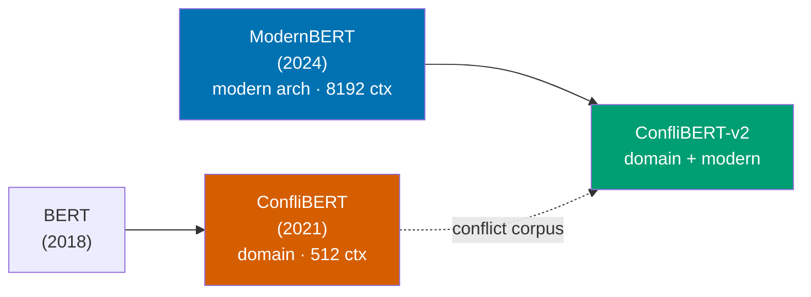
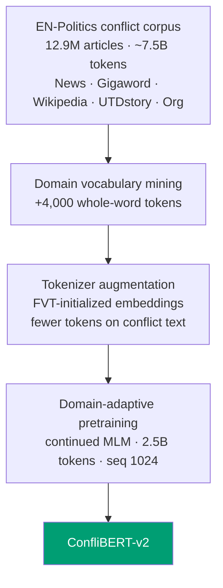

# ConfliBERT-v2

**A long-context, tokenizer-efficient encoder for political conflict and violence, built by domain-adaptive pretraining of [ModernBERT](https://huggingface.co/answerdotai/ModernBERT-base) on the EN-Politics conflict corpus.**

ConfliBERT (2021) modernized *the domain* for encoders. ConfliBERT-v2 modernizes *the encoder* for the domain: it pairs ModernBERT's 8,192-token context, efficiency, and modern architecture with continued masked-language-model pretraining on ~2.5B tokens of political-conflict text, plus a domain-augmented tokenizer.



---

## Why v2? The problem it solves for practitioners

Event-data researchers code millions of news documents. The incumbent ConfliBERT is a BERT-base capped at **512 tokens**, which quietly truncates long articles, discarding the parts of a story where casualties, perpetrators, and outcomes are usually stated.

On the EN-Politics conflict corpus (source-stratified sample, n = 200,000):

| Context window | Share of conflict articles that get truncated |
|---:|---:|
| **512** (BERT / ConfliBERT) | **44.6 %** |
| 1,024 | 15.8 % |
| 2,048 | 3.9 % |
| 4,096 | 1.1 % |
| **8,192** (ModernBERT / v2) | **~0 %** |

**45.2 % of all tokens in the corpus sit beyond position 512** - nearly half the signal is invisible to a 512-context model. ConfliBERT-v2 reads the whole document.



## What is new

- **Long context (8,192 tokens).** Document-level conflict coding without truncation.
- **Domain-augmented tokenizer.** ModernBERT's generic tokenizer fragments conflict jargon (for example *counterinsurgency*, *cantonment*, *al-Qaida*) into 3-4 subwords. We mined the corpus for the highest-value domain terms, added 4,000 whole-word tokens, and initialized their embeddings with Fast Vocabulary Transfer (mean of the original subwords). This yields roughly **19 % fewer tokens on conflict-domain sentences**, which also *reduces the truncation gap*.
- **Domain-adaptive pretraining.** Continued masked-LM (mask rate 0.30) on a deduplicated, conflict-dense 2.5B-token slice of the corpus.
- **Efficiency.** ModernBERT's throughput and memory profile, reproducible on a single consumer GPU.

## Intended uses and limitations

Intended for research and analysis of political conflict and violence: as a **base encoder to fine-tune** for classification, multi-label tagging, and token classification (NER), and for **fill-mask** exploration of conflict text. English only.

Limitations: trained on news-derived text, which carries the coverage and reporting biases of its sources; performance varies across event types and regions; not a substitute for human review in sensitive applications.

## How to use

Fill-mask:

```python
from transformers import pipeline

fill = pipeline("fill-mask", model="shreyasmeher/ConfliBERT-v2")
fill("Militants detonated an [MASK] near the checkpoint.")
```

Fine-tune for sequence classification:

```python
from transformers import AutoTokenizer, AutoModelForSequenceClassification

tok = AutoTokenizer.from_pretrained("shreyasmeher/ConfliBERT-v2")
model = AutoModelForSequenceClassification.from_pretrained(
    "shreyasmeher/ConfliBERT-v2", num_labels=NUM_LABELS)
# ... standard Trainer fine-tuning; supports sequences up to 8192 tokens.
```

## Training

| | |
|---|---|
| Base model | `answerdotai/ModernBERT-base` (150M params) |
| Objective | Continued masked-LM (mask rate 0.30) |
| Tokens | ~2.5B (deduplicated, conflict-dense source weighting) |
| Sequence length | 1,024 (model retains 8,192 inference context) |
| Optimizer | AdamW, lr 5e-5, cosine schedule, warmup 0.05 |
| Precision | bf16 autocast, fp32 master weights |
| Hardware | 1x NVIDIA RTX 4090 |
| Tokenizer | ModernBERT + 4,000 FVT-initialized domain tokens |

**Corpus.** The EN-Politics corpus assembled for ConfliBERT: ~12.9M articles / ~7.5B tokens across five sources (News, Gigaword, Wikipedia, UTD story, Organization), spanning 1945-2021. A temporal slice (2021) and a random slice are held out for evaluation and never trained on.

## Evaluation

Downstream evaluation on the ConfliBERT benchmark suite (binary and multi-label classification, NER) and a long-vs-short-document truncation analysis is **in progress**; results will be added here, comparing ConfliBERT-v2 against ConfliBERT and ModernBERT-base under one identical fine-tuning pipeline.

*Intrinsic (held-out conflict text): pseudo-perplexity decreased steadily throughout domain-adaptive pretraining.*

## Citation

```bibtex
@misc{meher2026conflibertv2,
  author = {Meher, Shreyas},
  title  = {ConfliBERT-v2: A Long-Context, Tokenizer-Efficient Encoder for Political Conflict},
  year   = {2026},
  publisher = {HuggingFace},
  howpublished = {\url{https://huggingface.co/shreyasmeher/ConfliBERT-v2}}
}
```

Please also cite the works this model builds on: ModernBERT (Warner et al., 2024) and ConfliBERT (Hu et al., 2022).

## Acknowledgements

This research was supported by NSF award 2311142. This work used Delta at NCSA / University of Illinois through allocation CIS220162 from the ACCESS program (NSF grants 2138259, 2138286, 2138307, 2137603, 2138296). Built on the ModernBERT architecture and the EN-Politics corpus assembled by the ConfliBERT team at UT Dallas.
